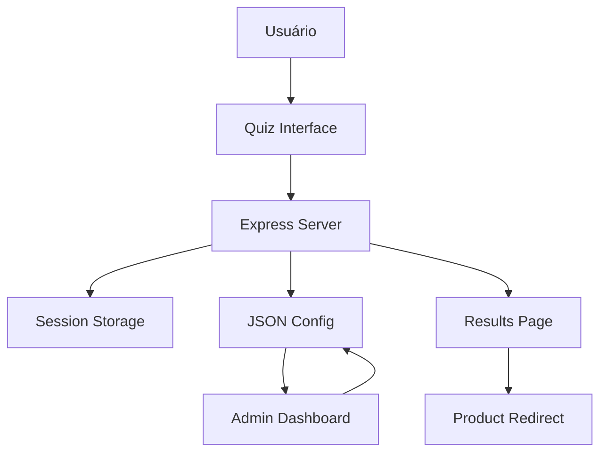

# 🎯 EzQuiz.shop - Documentação Completa

<div align="center">
  
  
  **Sistema de Quiz Interativo para E-commerce**
  
  [](https://nodejs.org/)
  [](https://expressjs.com/)
  [](https://ejs.co/)
  [](LICENSE)
</div>

---

## 📚 Sumário

1. [**Visão Geral**](#-visão-geral)
2. [**Instalação Rápida**](#-instalação-rápida)
3. [**Arquitetura do Sistema**](#-arquitetura-do-sistema)
4. [**Guias de Uso**](#-guias-de-uso)
5. [**Configuração**](#-configuração)
6. [**API Reference**](#-api-reference)
7. [**Customização**](#-customização)
8. [**Deploy**](#-deploy)
9. [**Troubleshooting**](#-troubleshooting)
10. [**Contribuição**](#-contribuição)

---

## 🎯 Visão Geral

O **EzQuiz.shop** é um sistema completo de quiz interativo desenvolvido para e-commerce, especialmente focado em produtos de saúde e bem-estar. O sistema permite criar experiências personalizadas para os usuários, coletando informações através de questionários dinâmicos e direcionando para produtos específicos.

### ✨ Principais Características

- 🎨 **Interface Moderna**: Design responsivo com animações suaves
- 📊 **Quiz Dinâmico**: Múltiplos tipos de pergunta (slider, múltipla escolha, checkbox)
- 🔧 **Painel Admin**: Sistema completo de administração sem banco de dados
- 📱 **Mobile-First**: Totalmente responsivo para todos os dispositivos
- ⚡ **Performance**: Carregamento rápido e otimizado
- 🛡️ **Segurança**: Autenticação protegida e validação de dados
- 📂 **File-Based**: Sistema baseado em arquivos JSON (sem DB)

### 🏗️ Stack Tecnológica

- **Backend**: Node.js + Express.js
- **Frontend**: EJS Templates + CSS3 + JavaScript ES6
- **Sessões**: Express-session
- **Configuração**: dotenv
- **Storage**: JSON Files

---

## 🚀 Instalação Rápida

### Pré-requisitos

- Node.js 18+ instalado
- npm ou yarn
- Editor de código (VS Code recomendado)

### Passos de Instalação

```bash
# 1. Clone o repositório
git clone https://github.com/seu-usuario/ezquiz.shop.git
cd ezquiz.shop

# 2. Instale as dependências
npm install

# 3. Configure as variáveis de ambiente
cp .env.example .env
# Edite o arquivo .env com suas configurações

# 4. Inicie o servidor
npm start

# 5. Acesse o sistema
# Quiz: http://localhost:8080
# Admin: http://localhost:8080/admin/login
```

### Estrutura do Projeto

```
EzQuiz.shop/
├── 📁 public/           # Arquivos estáticos
│   ├── css/
│   │   └── styles.css
│   └── js/
│       └── script.js
├── 📁 views/            # Templates EJS
│   ├── admin/
│   │   ├── login.ejs
│   │   └── dashboard.ejs
│   ├── quiz.ejs
│   ├── resultado.ejs
│   └── layout.ejs
├── 📁 data/             # Dados do quiz
│   └── quiz-config.json
├── 📁 Docs/             # Documentação
├── app.js               # Servidor principal
├── package.json         # Dependências
└── .env                 # Configurações
```

---

## 🏛️ Arquitetura do Sistema

### Fluxo de Dados



### Componentes Principais

1. **Express Server** (`app.js`)
   - Gerenciamento de rotas
   - Middleware de autenticação
   - Processamento de sessões

2. **Quiz Engine**
   - Carregamento dinâmico de perguntas
   - Validação de respostas
   - Cálculo de progresso

3. **Admin System**
   - Autenticação segura
   - Editor visual/JSON
   - Gerenciamento de configurações

4. **Data Layer**
   - Arquivo JSON para configurações
   - Sistema de backup automático
   - Validação de dados

---

## 📖 Guias de Uso

### Para Usuários Finais

1. **[Realizando um Quiz](guides/user-quiz.md)**
2. **[Interpretando Resultados](guides/user-results.md)**

### Para Administradores

1. **[Acesso ao Painel Admin](guides/admin-access.md)**
2. **[Criando Perguntas](guides/admin-questions.md)**
3. **[Configurando Emojis e Estilos](guides/admin-styling.md)**
4. **[Gerenciando Respostas](guides/admin-responses.md)**

### Para Desenvolvedores

1. **[Setup do Ambiente](guides/dev-setup.md)**
2. **[Customização de Temas](guides/dev-theming.md)**
3. **[Adicionando Novos Tipos de Pergunta](guides/dev-question-types.md)**
4. **[Integração com APIs](guides/dev-api-integration.md)**

---

## ⚙️ Configuração

### Variáveis de Ambiente

```bash
# Configurações do Admin Dashboard
ADMIN_USERNAME=admin
ADMIN_PASSWORD=quiz2025admin
ADMIN_SESSION_SECRET=quiz-admin-secret-key-2025

# Configurações do Servidor
PORT=8080
NODE_ENV=development
```

### Configuração do Quiz

O arquivo `data/quiz-config.json` contém toda a configuração do quiz:

```json
{
  "quiz": {
    "title": "Descubra Sua Solução para Barriga Estufada",
    "description": "Quiz personalizado para identificar seu perfil",
    "questions": [...]
  }
}
```

---

## 🔌 API Reference

### Endpoints Principais

| Método | Endpoint | Descrição |
|--------|----------|-----------|
| GET | `/` | Página inicial do quiz |
| POST | `/quiz` | Processar resposta do quiz |
| GET | `/resultado` | Página de resultados |
| GET | `/admin/login` | Login do administrador |
| POST | `/admin/login` | Autenticação |
| GET | `/admin/dashboard` | Painel administrativo |
| POST | `/admin/save-quiz` | Salvar configurações |

### [📋 Documentação Completa da API](api/endpoints.md)

---

## 🎨 Customização

### Temas e Estilos

O sistema suporta total customização visual através de CSS:

- **Cores**: Paleta de cores personalizável
- **Animações**: Transições suaves e loading
- **Responsividade**: Design mobile-first
- **Tipografia**: Fontes e tamanhos adaptáveis

### Tipos de Pergunta

- ✅ **Slider**: Para valores numéricos (peso, idade, etc.)
- ✅ **Single Choice**: Seleção única com gradientes
- ✅ **Multiple Choice**: Seleção múltipla com checkboxes
- ✅ **Custom**: Tipos personalizados

---

## 🚀 Deploy

### Opções de Deploy

1. **Heroku**: Deploy automático via Git
2. **Vercel**: Ideal para projetos Node.js
3. **Digital Ocean**: VPS tradicional
4. **Railway**: Platform moderna para Node.js

### [📋 Guia Completo de Deploy](guides/deployment.md)

---

## 🛠️ Troubleshooting

### Problemas Comuns

1. **Erro de Porta**: Verifique se a porta 8080 está livre
2. **Sessões não funcionam**: Verifique o `SESSION_SECRET`
3. **Admin não carrega**: Confirme as credenciais no `.env`

### [📋 Guia Completo de Troubleshooting](guides/troubleshooting.md)

---

## 🤝 Contribuição

Contribuições são bem-vindas! Por favor, leia nosso [Guia de Contribuição](CONTRIBUTING.md) antes de enviar PRs.

### Como Contribuir

1. Fork o projeto
2. Crie uma branch (`git checkout -b feature/AmazingFeature`)
3. Commit suas mudanças (`git commit -m 'Add AmazingFeature'`)
4. Push para a branch (`git push origin feature/AmazingFeature`)
5. Abra um Pull Request

---

## 📄 Licença

Este projeto está licenciado sob a Licença MIT - veja o arquivo [LICENSE](LICENSE) para detalhes.

---

## 📞 Suporte

- 📧 **Email**: suporte@ezquiz.shop
- 💬 **Discord**: [Servidor EzQuiz](https://discord.gg/ezquiz)
- 📚 **Documentação**: [docs.ezquiz.shop](https://docs.ezquiz.shop)
- 🐛 **Issues**: [GitHub Issues](https://github.com/seu-usuario/ezquiz.shop/issues)

---

<div align="center">
  
  **Desenvolvido com ❤️ pela equipe EzQuiz**
  
  [Website](https://ezquiz.shop) • [Documentação](https://docs.ezquiz.shop) • [GitHub](https://github.com/seu-usuario/ezquiz.shop)
  
</div>
